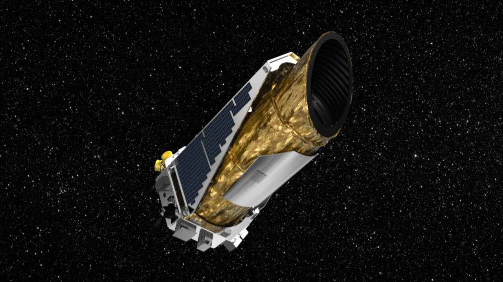

```{r setup, include=FALSE}
knitr::opts_chunk$set(warning = FALSE, message = FALSE) 
library(tidyverse)
library(ggplot2)
library(hrbrthemes)
library(scales)
library(gganimate)
library(gifski)
library(png)
library(transformr)
library(ggthemes)
```

```{r echo=FALSE}
planets <- readr::read_csv("data/planets.csv")
#temp <- readr::read_csv("https://data.world/markmarkoh/kepler-confirmed-planets/workspace/file?filename=planets.csv")
#temp Tried reading csv directly from url but this returns only 7 records, Hence I use the downloaded file directly.

```

```{css, echo=FALSE}
p.caption {
  font-size: 10px;
}

p.explanation {
background-color: #DBDBDB;
padding: 10px;
border: 1px solid black;

border-radius: 5px;
font-style: italic;
background-image: url("data/stars.jpg");
color : white;
}
```

```{r echo=FALSE, out.width = "100%", out.width = "100%", fig.cap = "The Kepler Space Telescope | Image source : NASA"}
#
```
<br>
<p class="explanation">
For hundreds of years, humans thought if there are other planets apart from the ones in our solar system. We do see stars at night but we did not know if there are other planets around other stars! Thus, on March 6th 2009, the Kepler Space telescope was launched in search of Planets and potential life. The illustrations below explore the confirmed exo-planets that were found. It is intriguing to see how far Kepler was able to see in space.
</p>

```{r, echo=FALSE,fig.width = 13,fig.height=10}
planets|>
  filter(pl_discmethod != "Astrometry" & pl_discmethod!= "Pulsation Timing Variations" )|>
  ggplot()+
  aes(x=pl_discmethod, y = pl_orbper, fill = pl_discmethod)+
  geom_violin(trim = FALSE,show.legend = FALSE)+
  labs(y = "Orbital Period", x = "Method", caption="Fig1: Some methods are better for different orbital periods")+
  scale_fill_viridis_d()+
  scale_fill_ipsum()+
  scale_y_continuous(trans = "log10"  , labels = label_comma() , n.breaks = 10)+
  ggtitle("Planet Discovery Methods")+
  theme(plot.caption.position = "plot",
        plot.caption = element_text(hjust = 0,size = 15),plot.title = element_text(size=25,hjust=0.5),axis.title.x = element_text(size = 18, hjust = 0.5),axis.title.y = element_text(size = 18, hjust = 0.5))
```
<p class="explanation">
Fig1 gives an overall idea of the different Planet Discovery Methods and how various methods are better for detecting planets with a certain orbital period. Orbital Period is nothing but the time taken by the planet to make a complete revolution around it's star. It is clear that planets with very short orbital periods are mostly detected with Pulsar timing, while planets with very long orbital periods are detected by Imaging. 
</p>
<br>

```{r , echo = FALSE, fig.width= 15, fig.height=10,echo=FALSE}
# This plot gets the planets with shortest year !

planets |>
  arrange(pl_orbper)|>
  slice(1:30)|>
  ggplot()+
  aes(x=pl_orbper*24,y = reorder(pl_hostname, pl_orbper*24), colour=pl_discmethod , group=pl_discmethod)+
  labs(y = "Hostname", x = "Orbital Period (Earth Hours)" , caption = "Fig2.a Extrapolation of Fig1 to show planets with shortest year")+
  geom_point(size=4)+
  geom_line()+
  scale_fill_ipsum() +
  theme_ft_rc(14) +
  scale_x_continuous(breaks = scales::pretty_breaks(n = 10))+
  scale_color_discrete(name="Discovery Method")+
  ggtitle("Planets with the Shortest Year")+
  theme(plot.caption.position = "plot",
        plot.caption = element_text(hjust = 0,size=15, face="italic", color="white"),axis.title.x = element_text(size = 18, hjust = 0.5,color = "white"),axis.title.y = element_text(size = 18, hjust = 0.5,color="white"),plot.title = element_text(size=25,hjust=0.5))

```
<p class="explanation">
Fig2.a shows 30 planets with the shortest Orbital Period. As was shown by Fig1, planets with very less orbital periods are detected by Pulsar timing. This is also confirmed by Fig2.a. The most interesting result is about the planet "PSR J1719-1438". There, a year lasts slightly more than 2 Earth hours. On further investigation, I found that the planet is orbiting a neutron star and is completely made of Diamonds 💎 
</p>
<br>

```{r, echo=FALSE,fig.width= 15, fig.height=10}
# This plot gets the planets with the longest year !
planets |>
  arrange(desc(pl_orbper))|>
  slice(1:30) |>
  ggplot()+
  aes(x=pl_orbper,y = reorder(pl_hostname, pl_orbper) , colour=pl_discmethod,group=pl_discmethod)+
  labs(y = "Hostname", x = "Orbital Period (Earth Days)",caption = "Fig2.b Extrapolation of Fig1 to show planets with longest year")+
  ggtitle("Planets with the Longest Year")+
  geom_point(size=5)+theme_igray()+
  scale_x_continuous(labels = label_comma(),trans = 'log10')+
  scale_color_discrete(name="Discovery Method")+
  theme(plot.caption.position = "plot",
        plot.caption = element_text(hjust = 0,size=15, face="italic", color="black"),axis.title.x = element_text(size = 18, hjust = 0.5),axis.title.y = element_text(size = 18, hjust = 0.5),plot.title = element_text(size=25,hjust=0.5))
```
<p class="explanation">
Fig2.b shows 30 planets with the longest Orbital Period. As was shown by Fig1, planets with very long orbital periods are detected by Imaging. The planet travels around its star at a very slow pace and hence, this makes it easier to capture the transition of the planet in front of it's star with Imaging. Fig.2b confirms the results in Fig1. The planet with Longest year : Oph11 is actually a twin system. These twins have only about one percent the mass of our Sun, and they do not actually orbit a star, but instead they orbit themselves.
</p>
<br>
```{r, echo=FALSE , fig.width=15, fig.height=10}
planets |>
  ggplot()+
  aes(x= pl_orbper , y = pl_bmassj,colour = cut(st_teff, c(2000, 3000, 4000, 6000, 10000,60000)))+ 
  labs(y = "Mass (Jupiter Mass)", x = "Orbital Period (Earth Days)",caption = "Fig3 Certain methods are more effective for a given planet Size and Orbital Period")+
  ggtitle("Planet Mass by Orbital Period")+
  geom_point(alpha = 0.5,size=4)+
   scale_color_manual(name = "Temperature(K)",values = c("blue","green","yellow","orange","red"),c('500-2000', '2000-3000','3000-4000','4000-6000','6000-10000'), na.translate = FALSE)+
  scale_fill_ipsum() +
  theme_ft_rc(14) +
  scale_fill_viridis_d()+
  facet_wrap(~pl_discmethod,scales='free')+
  theme(plot.caption.position = "plot",
        plot.caption = element_text(hjust = 0,size=15, face="italic", color="white"),axis.title.x = element_text(size = 20,hjust =  0.5,color='white'),axis.title.y = element_text(size = 20,hjust=0.5,colour = "white"),plot.title = element_text(size=25,hjust=0.5),legend.text = element_text(size=15),legend.title = element_text(size=20))+
  scale_y_continuous(labels = label_comma(),trans = 'log10')+
  scale_x_continuous(labels = label_comma(),trans = 'log10') 
```
<p class="explanation">
A lot of information is provided by Fig3 above. The general idea is that a larger planet will take longer to revolve. However, the figure provides very interesting results. The most common temperature range is 3000-4000 K. There are much colder and bigger planets too (usually found by Imaging). The hottest planets are also some of the smallest(Orbital Brightness Modulation). Their orbital period suggests that they are much closer to their stars and that explains their high temperature.
</p>
<br>

```{r, echo=FALSE , fig.width=15}
planets %>%
  drop_na(st_teff)|>
  ggplot()+
  aes(x= pl_orbper , y = pl_bmassj, colour = cut(st_teff, c(2000, 3000, 4000, 6000, 10000,60000)))+
  labs(y = "Mass", x = "Orbital Period (Earth Days)",title = 'Planet Discoveries in Year: {round(frame_time,0)}',caption = "Fig4: More planets were discovered as Kepler spent more time in space")+
  geom_point(alpha = 0.5,size=5)+
  scale_color_manual(name = "Temperature(K)",values = c("blue","green","yellow","orange","red"),c('500-2000', '2000-3000','3000-4000','4000-6000','6000-10000'), na.translate = FALSE)+
  scale_y_continuous(labels = label_comma(),trans = 'log10')+
  scale_x_continuous(labels = label_comma(),trans = 'log10')+
  theme_igray()+
  theme(axis.title.x = element_text(size = 20 , hjust = 0.5),axis.title.y = element_text(size = 20,hjust=0.5),plot.title = element_text(size=25,hjust=0.5),plot.caption.position = "plot",
        plot.caption = element_text(hjust = 0,size=15, face="italic", color="black"))-> disc_by_year

disc_animation = disc_by_year + transition_time(disc_year) +shadow_mark()
animate(disc_animation, width=900,fps=5, end_pause = 30)
```
<br>
<br>

```{r, echo=FALSE , fig.height=10, fig.width=15}
planets |>
  arrange(desc(st_dist))|>
  slice(1:40)|>
  group_by(pl_discmethod)|>
  ggplot()+
  scale_fill_ipsum() +
  theme_ft_rc(14) +
  aes(y = reorder(pl_hostname, -st_dist), x= st_dist*3.26156 , fill=pl_discmethod)+
  ggtitle("Top 40 Farthest planets from Earth")+
  xlim(0,27800)+
  labs(x = "Distance (Light Years)", y = "Planet Name", caption = "Fig5: Microlensing has been very effective in detecting some of the farthest planets")+
  geom_bar(stat = "identity" , alpha = 0.7)+
  geom_text(aes(label=ceiling(st_dist*3.26156))  ,hjust = 1, color='black')+ #round of to the ceil value
  scale_fill_discrete(name = "Discovery Method")+
  theme(legend.text = element_text(size=15),legend.title = element_text(size=20),plot.caption.position = "plot",
        plot.caption = element_text(hjust = 0,size=15, face="italic", color="white"),plot.title = element_text(size=25,hjust=0.5),axis.title.x = element_text(size = 20 , hjust = 0.5,colour = 'white'),axis.title.y = element_text(size = 20,hjust=0.5,colour = 'white'))
```

